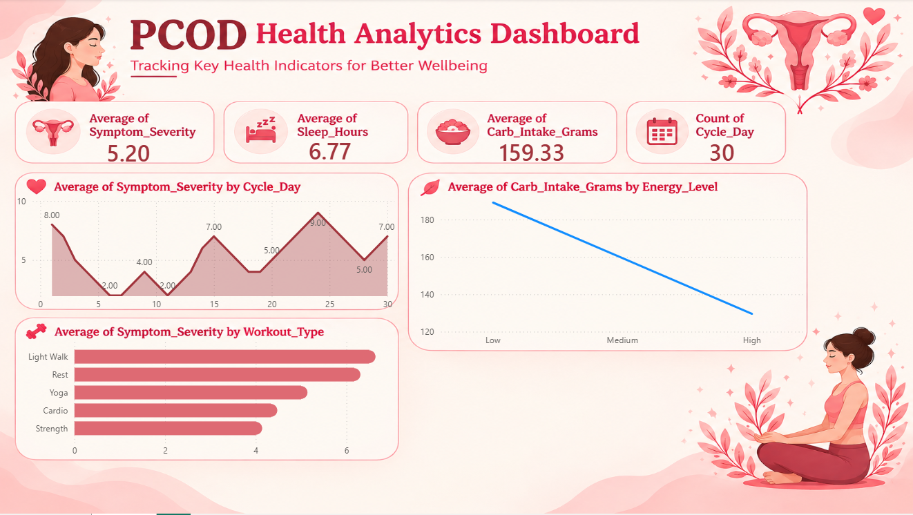

# 🩺 PCOD Health & Lifestyle Dashboard

## 📊 Project Overview

The **PCOD Health & Lifestyle Dashboard** is an interactive Power BI dashboard designed to analyze patterns between **PCOD symptoms, lifestyle habits, sleep, diet, physical activity, and other health-related factors**.

The goal of this project is to transform raw health and lifestyle data into meaningful visual insights that can help identify common patterns and trends.
## 📊 Dashboard Preview




## 🎯 Objectives

* Analyze the distribution of PCOD-related symptoms.
* Understand the relationship between lifestyle habits and PCOD symptoms.
* Analyze sleep, physical activity, and dietary patterns.
* Identify important trends using interactive Power BI visuals.
* Present complex data in a simple and easy-to-understand dashboard.

## 🛠️ Tools & Technologies

* **Power BI** – Dashboard development and data visualization
* **Power Query** – Data cleaning and transformation
* **DAX** – Measures and calculations
* **Excel/CSV** – Data source
* **Data Analysis & Visualization** – Pattern and trend analysis

## 📌 Dashboard Features

* Interactive KPI cards
* PCOD symptom analysis
* Lifestyle pattern analysis
* Sleep analysis
* Diet and nutrition insights
* Physical activity analysis
* Interactive filters and slicers
* Easy-to-understand charts and visualizations

## 🔍 Key Insights

The dashboard helps explore questions such as:

* Which PCOD symptoms are most commonly reported?
* How do lifestyle habits vary among respondents?
* What are the average sleep and activity patterns?
* Are there noticeable patterns between diet and symptoms?
* How can different health and lifestyle factors be compared interactively?

## 📷 Dashboard Preview

Add your dashboard screenshot here:

``

## 📁 Project Structure

```text
PCOD-Dashboard/
│
├── PCOD Dashboard.pbix
├── dashboard.png
└── README.md
```

## 🚀 How to Use

1. Download the `.pbix` file from this repository.
2. Open it using **Microsoft Power BI Desktop**.
3. Explore the dashboard using the available slicers and filters.
4. Interact with the visuals to analyze different health and lifestyle patterns.

## 📚 Learning Outcomes

Through this project, I practiced:

* Data cleaning and transformation
* Data visualization
* Creating interactive Power BI dashboards
* Using DAX measures
* KPI creation
* Identifying patterns from datasets
* Presenting data-driven insights

## ⚠️ Disclaimer

This dashboard is created for **data analysis and educational purposes only**. The insights shown should not be considered medical advice or used for medical diagnosis.

## 👩‍💻 Author

**Harshita Bisht**

Final-Year Computer Science & Engineering Student
Interested in **Data Analytics, Power BI, SQL, Python and Business Intelligence**.
